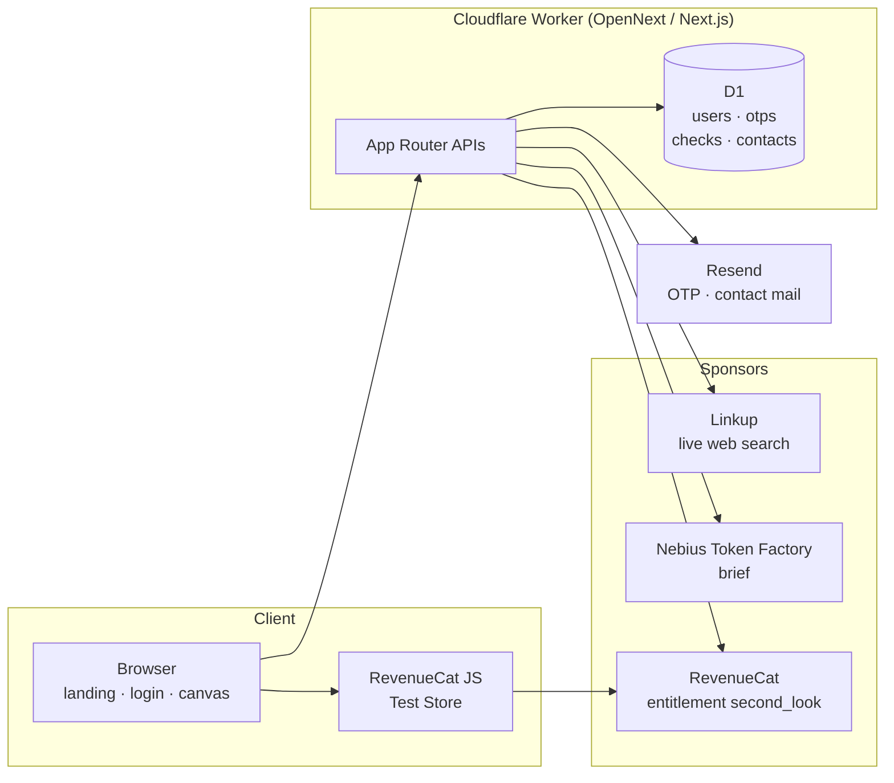
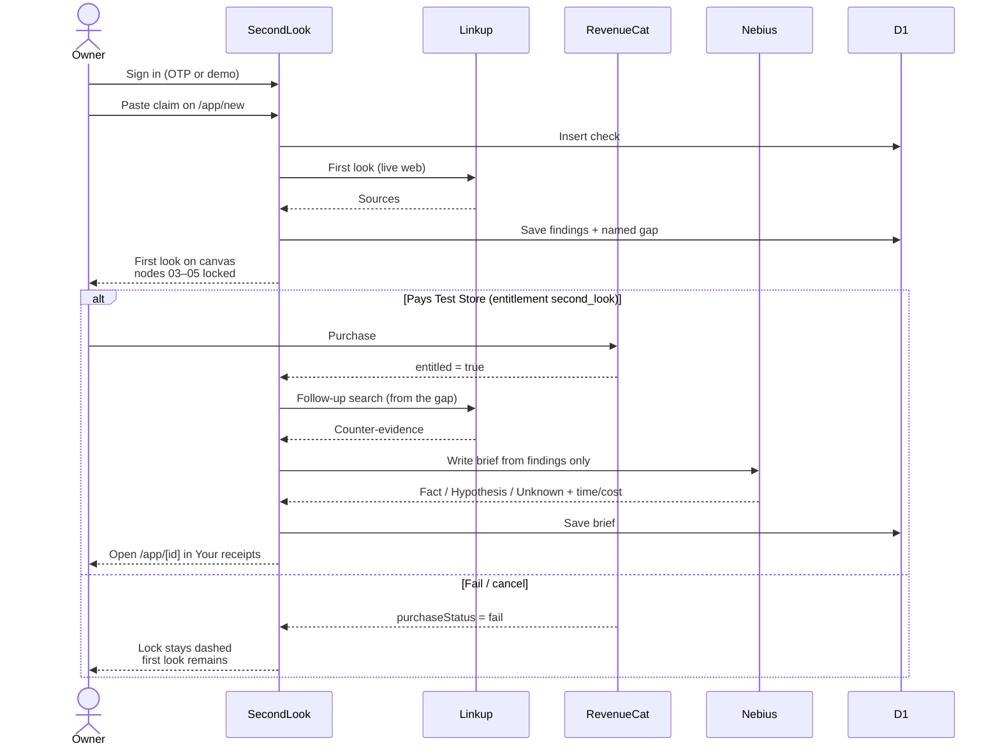

# SecondLook

Paste a market claim. Keep the receipt.

Live: [secondlook.juliomcruz.workers.dev](https://secondlook.juliomcruz.workers.dev)

Personal product for **Burning Token (NERDCONF)**. English UI. One account, one canvas, a folder of briefs.

It is not a chatbot, not a stack recommender, and not an interview. It verifies **one sentence someone tried to sell you** and stores the paper.

## What the user gets

You walk in with a sentence from a sales deck. You walk out with a file on your account.

| Always (free first look) | If you pay (second look) |
|---|---|
| The claim, dated | A second live-web search aimed at the gap |
| Sources from a **live web** search | A written verdict: **Fact / Hypothesis / Unknown** |
| The hole in the pitch, named | Time and token cost of the run |

Fail or cancel the purchase: nodes 03–05 stay locked. The first look remains yours.

The product is **Your receipts** (`/app`) — the folder, not the chat.

## How a check runs

1. Sign in (email + 6-digit code) or **Try with demo**.
2. Paste the claim on `/app/new`.
3. **First look (free):** Linkup search → findings saved on the account → gap named.
4. Paywall: RevenueCat Test Store entitlement `second_look`.
5. **Second look (paid):** Linkup follow-up on the gap → Nebius Token Factory writes the brief.
6. Brief lives at `/app/[id]`. Open it next week. The folder grows.

## Sponsors (cash tracks)

One product, three load-bearing SDKs. Not three apps.

| Track | Sponsor | Where it sits in the product |
|---|---|---|
| Deep Research · **$500** | [Linkup](https://www.linkup.so/) | Search 1 (free) stores sources. Search 2 runs **only after** entitlement and is a **follow-up query built from those findings**. Sources stay in two groups on the brief. |
| Applied AI · **$500** | [Nebius Token Factory](https://tokenfactory.nebius.com/) | Inference on the **main path** after unlock. Writes Fact / Hypothesis / Unknown from Linkup findings only (no extra browsing). Brief shows **time** and **cost**. |
| Subscriptions · **$500** | [RevenueCat](https://www.revenuecat.com/) | Test Store. Entitlement `second_look` is the gate on nodes 03–05. Before: first look only. After: gap + follow-up + brief. **Simulate fail** keeps the lock. Expiry hides the paid brief; first look stays. |

Not a prize track, but used in prod:

- **Cloudflare Workers + D1** — host, auth, checks, contact notes
- **Resend** — login OTP and contact notify / autoresponder (personal key; not a sponsor)

## Architecture



Request map:

| Route | Job |
|---|---|
| `POST /api/auth/otp` | Email a 6-digit code (Resend) |
| `POST /api/auth/demo` | Judge demo session |
| `POST /api/checks` | Create a check from the pasted claim |
| `POST /api/checks/:id/first-look` | Linkup search 1 + save findings + gap |
| `POST /api/checks/:id/unlock` | Verify `second_look` → Linkup search 2 → Nebius brief |
| `POST /api/contact` | Store note in D1; notify Julio; autoresponder |

## User sequence



## Run locally

```bash
npm install
cp .env.example .env.local
# LINKUP_API_KEY, NEBIUS_API_KEY,
# NEXT_PUBLIC_REVENUECAT_TEST_STORE_API_KEY, AUTH_SECRET
npm run dev
```

Open [http://localhost:3000](http://localhost:3000) → **Try with demo**.

## Env

See `.env.example`.

- `NEXT_PUBLIC_REVENUECAT_TEST_STORE_API_KEY` — public Test Store key in the browser (`test_` / `rcb_`)
- `REVENUECAT_SECRET_API_KEY` — server only (`sk_`)
- `NEBIUS_MODEL` — Token Factory id (default `openai/gpt-oss-120b`)
- `RESEND_API_KEY` / `EMAIL_FROM` — OTP and contact mail
- `CONTACT_NOTIFY_EMAIL` — landing form notify (default Julio)

Do not commit secrets.

## Deploy

Cloudflare Workers via OpenNext:

```bash
npm run deploy
```

D1 database: `secondlook`. Schema in `schema.sql`.

## Test purchase

Personal RevenueCat project. **Test Store** API key. Entitlement id: `second_look`.

| Path | What judges should see |
|---|---|
| Success | Nodes 03–05 mount; brief saved |
| Simulate fail | Nodes stay dashed; first look kept |
| Expiry | Paid brief hidden; first look remains |
