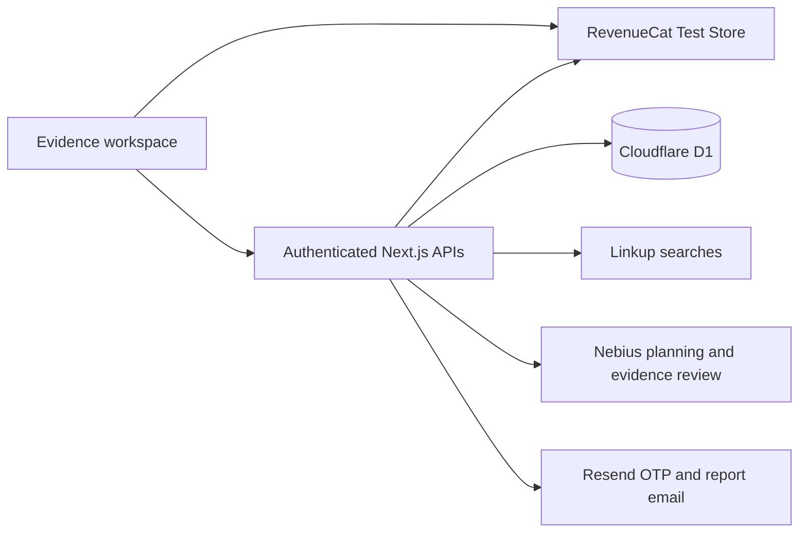

# SecondLook

**Before you buy, check the proof.**

[Open the app](https://secondlook.juliomcruz.workers.dev) · [Watch the 60-second pitch](https://secondlook.juliomcruz.workers.dev/secondlook-pitch-v2.mp4) · [Try an isolated demo](https://secondlook.juliomcruz.workers.dev/login?demo=1)

SecondLook helps small business owners evaluate a sales claim before committing to a purchase. It searches the live web, identifies missing evidence, and turns a targeted follow-up into a saved brief with source passages and questions for the seller. English and Spanish.

## The product

1. **Define the claim.** Paste or dictate what you were promised. The first assessment is free.
2. **Investigate the evidence.** Linkup retrieves sources. Nebius identifies a specific gap and the next research question.
3. **Prepare your response.** A RevenueCat Test Store purchase unlocks the follow-up and an evidence brief: supported, contradicted, or insufficient evidence. Inspect exact passages, copy questions, download Markdown, or preview and download an evidence PDF. Signed-in users can email the PDF as an attachment.

For example, “All my competitors in Miami use AI on WhatsApp” requires a defined competitor set and adoption evidence. A vendor offering automation does not establish that claim. An unresolved finding is a useful result, with concrete proof to request next.

## Sponsor integrations

| Track | Integration | Role |
|---|---|---|
| Deep Research | Linkup | First live-web search and targeted second search; original sources remain attached to the assessment. |
| Applied AI | Nebius Token Factory | Research planning, evidence synthesis and a separate inference review for supported/contradicted findings. Default model: `openai/gpt-oss-120b`. |
| Subscriptions | RevenueCat | Test Store offering and purchase; `second_look` entitlement is verified server-side for the authenticated user. |

Cloudflare Workers/OpenNext hosts the app, D1 stores assessments, and Resend delivers OTP and report emails. Voice input uses a Cloudflare Whisper binding, followed by Nebius transcription cleanup.

## Trust and access

- The model selects numbered passages. The server resolves the exact source text and rejects nonexistent citations.
- Citation matching verifies the retrieved text, **not the truth of the source**. A separate model review checks whether a conclusion follows from the quoted evidence.
- Paid data is removed from API responses when entitlement is absent, expired, or cannot be verified. Client assertions cannot grant access.
- Failed/cancelled purchases preserve the free assessment. Duplicate unlock requests are guarded by a database lease.
- Each demo session has an independent account. Signed-in users can only retrieve their own assessments.
- OTP requests, verification attempts and report-email retries are limited. Reports are sent only to their intended recipient.

## Judge walkthrough

1. Select **Try the demo** and create an assessment using the Miami example.
2. Inspect the evidence gap and the proposed follow-up query.
3. Select **Test purchase**. In the RevenueCat modal, select **Test failed purchase**; the free assessment remains available.
4. Retry, then select **Test valid purchase**. The server verifies the same user's entitlement and generates the brief.
5. Inspect source passages and missing proof. Copy the seller questions or open the full brief to download it.
6. Reload to confirm the saved assessment remains available. A different demo session starts with its own empty workspace.

**All checkout transactions are RevenueCat Test Store transactions. No real charge or revenue.** The RevenueCat track explicitly accepts sandbox/test purchases. The demo mailbox is intentionally fictional; download its brief before signing out. Email sign-in and delivery use the configured Resend sender; the current onboarding sender is restricted to the account's permitted test recipient.

## Architecture



## Run locally

```bash
npm install
cp .env.example .env.local
# Fill AUTH_SECRET, LINKUP_API_KEY, NEBIUS_API_KEY,
# NEXT_PUBLIC_REVENUECAT_TEST_STORE_API_KEY and RESEND_API_KEY.
npm run db:local
npm run dev
```

Use the public Test Store SDK key from the **same RevenueCat project** as the `second_look` entitlement and offering. It is public by design and is also used for read-only subscriber verification. Secret API keys are not needed by this implementation. Never commit private provider keys or `.env` files.

## Validation

```bash
npm test
npm run lint
npx tsc --noEmit
BASE_URL=http://localhost:3000 npm run test:smoke
npm run evaluate
# Reuse saved source material, with fresh model calls:
REPLAY=1 npm run evaluate
```

Smoke tests create isolated demo records and call real providers; `BASE_URL` is mandatory. The four-case EN/ES evaluation checks corporate ownership and undefined universal adoption. It is a small regression set, **not a general accuracy benchmark**. See [evaluation](evaluation/README.md), [UX notes](docs/UX-SPRINT.md), and [pitch script](docs/PITCH-V2.md).

## Deployment

```bash
npm run deploy
```

The D1 schema is in `schema.sql`. Rate-limit and processing-lease tables are created lazily. This hackathon build demonstrates a professional evidence workflow; it does not claim SSO, enterprise roles, compliance certification, or an SLA.

## Final hackathon demo

[Watch the public 4K demo](https://youtu.be/DPstAoHE2j8). Updated narration and a three-page English evidence PDF preview. [Build and validation notes](docs/pitch-v4/README.md).
